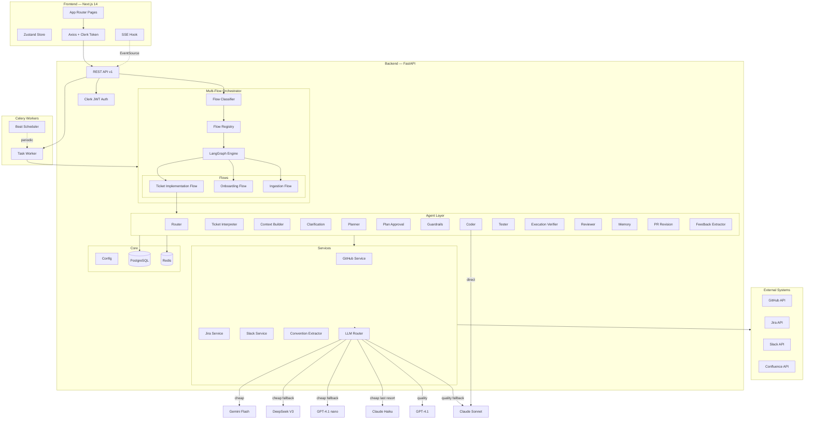
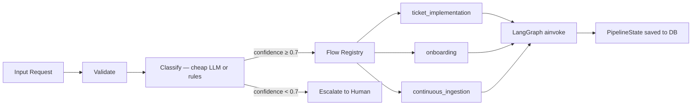
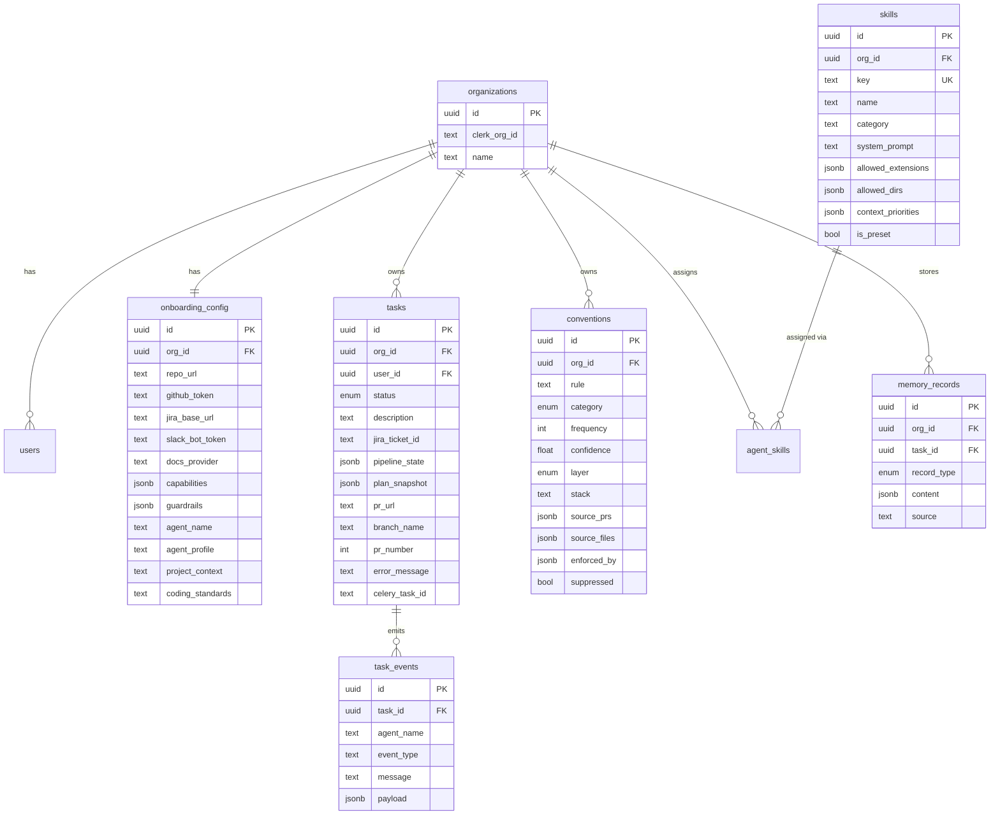

# Kronode Architecture

## System Overview



---

## Multi-Flow Orchestration (LangGraph)

The orchestrator replaced the original single-pipeline design. Incoming requests are classified into one of three flows, each compiled as a LangGraph `StateGraph`.



### Flow Classification

**Rule-based (fast path):**
| Action keyword | Flow | Confidence |
|---|---|---|
| `implement`, `ticket`, `feature`, `bugfix` | ticket_implementation | 0.95 |
| `onboard`, `setup`, `initialize` | onboarding | 0.95 |
| `ingest`, `sync`, `refresh` | continuous_ingestion | 0.95 |
| Has `ticket_id` or `description` | ticket_implementation | 0.85 |
| Has `github_repo` only | onboarding | 0.75 |

Falls back to LLM classification when no rule matches.

### PipelineState

A single dataclass tracks the entire lifecycle. Serialized as JSONB in `task.pipeline_state` for pause/resume.

Key sections: task metadata, routing result, ticket interpretation, context (files + conventions), clarification state, plan + confidence, guardrails result, coding output (branch, PR, files), test/verify/review results, memory records, event log, error list.

Status transitions:
```
queued → running → waiting_clarification → running → paused → in_review → done
                                                                        → failed
                                                                        → cancelled
```

---

## Ticket Implementation Flow (14 steps)

See [router-flow.md](router-flow.md) for the full Mermaid diagram.

| # | Node | Agent | Model | Conditional? |
|---|------|-------|-------|---|
| 1 | initialize | — | — | |
| 2 | route | RouterAgent | cheap | |
| 3 | interpret_ticket | TicketInterpreterAgent | cheap | |
| 4 | build_context | ContextBuilderAgent | cheap | |
| 5 | check_clarification | ClarificationAgent | cheap | → END if waiting |
| 6 | generate_plan | PlannerAgent | quality | |
| 7 | approve_plan | PlanApprovalAgent | — | |
| 8 | check_guardrails | GuardrailsAgent | — | → END if blocked |
| 9 | generate_code | CoderAgent | claude-sonnet-4-6 | |
| 10 | generate_tests | TesterAgent | — | |
| 11 | verify_execution | ExecutionVerifierAgent | — | |
| 12 | review_implementation | ReviewerAgent | — | → loop to 9 (max 3) |
| 13 | store_memory | MemoryAgent | — | |
| 14 | finalize | — | — | |

**Simple tasks** (router complexity = SIMPLE) skip steps 3–8, going directly to coder + memory.

---

## Agent Architecture

All agents extend `BaseAgent` with `async run(context: dict) → dict`.

```
backend/app/agents/
├── base.py                  # Abstract base
├── router_agent.py          # Classify task, select agent subset
├── ticket_interpreter.py    # Raw ticket → structured requirements + acceptance criteria
├── context_builder.py       # Repo tree → file selection → convention ranking (546 lines)
├── clarification_agent.py   # Detect ambiguity → post to Slack → pause
├── planner_agent.py         # Subtasks, file paths, DoD, risk flags, confidence 0.0–1.0
├── plan_approval_agent.py   # Post plan to Slack + Jira comment (no gate)
├── guardrails_agent.py      # 5 rule-based checks, can block pipeline
├── coder_agent.py           # Anthropic SDK → write files → create branch → open PR
├── tester_agent.py          # Generate tests → commit to PR branch
├── execution_verifier.py    # Run build/tests/lint (stub)
├── reviewer_agent.py        # Critic pass against DoD
├── pr_revision_agent.py     # Address review comments → push to same branch
├── feedback_extractor.py    # Extract conventions from PR review outcomes
├── memory_agent.py          # Write file_touched + pattern MemoryRecords
└── doc_agent.py             # (stub)
```

### Context Builder Detail

No LLM call for file selection — pure heuristic scoring:

| Signal | Score |
|--------|-------|
| Config file (package.json, pyproject.toml, etc.) | +3 |
| Source file (.ts, .py, .go, etc.) | +1 |
| Matches skill `context_priorities` | +2 |
| Previously touched by org (`file_touched` MemoryRecord) | +2 |
| Filename overlaps task description keywords | +2 |

Top 12 selected → 10 fetched → capped at 4KB/file, 30KB total.

Convention ranking uses 7 signals (layer boost, keyword overlap, category relevance, file path match, source file match, embedding similarity, frequency). Top 30 returned, customer-layer always included.

---

## LLM Routing

```
cheap()  →  Gemini Flash → DeepSeek V3 → GPT-4.1 nano → Claude Haiku
quality() → GPT-4.1 → Claude Sonnet 4.6
coder     → Claude Sonnet 4.6 (direct, tools-based)
```

Skips providers with no API key. Fails over on any error (rate limit, quota, network).

### Embeddings

Convention semantic similarity uses OpenAI `text-embedding-3-small` ($0.02/MTok). In-memory cache, batched in chunks of 100. Cosine similarity computed in Python (no pgvector). Falls back to keyword matching if no OpenAI key set.

---

## Legacy Profiles

`backend/app/profiles/` contains 7 legacy profile modules (web, backend, fullstack, devops, mobile_ios, mobile_android, data). These are superseded by the composable skill system but still used as fallback via `get_profile(key)` when an org has `agent_profile` set but no skills assigned. The skill composer auto-migrates on first use.

---

## Data Model



**Key enums:**
- `TaskStatus`: queued, running, waiting_clarification, paused, in_review, done, failed, cancelled
- `convention.category`: naming, error_handling, testing, logging, architecture, style
- `convention.layer`: base (community), customer (org-specific)
- `memory.record_type`: pattern, reviewer_feedback, pitfall, convention, clarification, file_touched, pr_outcome

---

## Skill Composition

Replaced fixed agent profiles (web/backend/fullstack) with composable skills.

```
18 curated preset skills across 7 bundles:
  web        → React & Next.js, Tailwind, TypeScript Strict
  backend    → FastAPI, PostgreSQL, Celery & Redis
  fullstack  → API Contract First + web + backend skills
  devops     → Docker & K8s, Terraform, GitHub Actions
  mobile_ios → Swift & SwiftUI
  mobile_android → Kotlin & Jetpack Compose
  data       → dbt & SQL, Airflow, Snowflake
```

`compose_skills(org_id)` merges selected skills into:
- `system_prompt` — concatenated, injected into planner
- `allowed_extensions` — set union, enforced by guardrails
- `allowed_dirs` — ordered union, enforced by guardrails
- `context_priorities` — boosts file scoring in context builder

---

## Convention System (Two-Layer)

```
Base layer    — extracted from open-source repos (Cal.com for TypeScript)
                Solves cold-start. org_id = NULL, filtered by stack.

Customer layer — extracted from org's own PR history + review feedback
                 Always overrides base. Grows with every merged PR.
```

### Lifecycle

| Trigger | Source | Volume |
|---------|--------|--------|
| Onboarding | Last 200 merged PRs | Batch |
| Weekly refresh (Celery Beat) | Last 50 PRs per org | Incremental |
| PR merged | Review comments on that PR | Per-PR |
| Changes requested | Reviewer corrections | Per-PR |
| Base extraction | Cal.com 200 PRs | One-time seed |

Extraction uses cheap LLM. Deduplication by normalized rule text. Confidence = 0.3 base + 0.7 × relative frequency. Stops early if dedup rate > 80%.

---

## Services

| Service | Status | Key Methods |
|---------|--------|-------------|
| **GitHub** | Impl | `get_repo_tree`, `get_file_content`, `create_pull_request`, `add_files_to_branch`, `get_pr_status`, `fetch_merged_prs` |
| **Jira** | Impl | `fetch_project_tickets`, `fetch_ticket_detail`, `update_ticket_status`, `post_plan_comment` |
| **Slack** | Impl | `post_notification`, `post_clarification`, `get_thread_replies`, `post_plan_for_approval`, `post_conventions_review` |
| **Convention Extractor** | Impl | `extract_conventions_from_pr`, `deduplicate_conventions`, `score_conventions` |
| **LLM Router** | Impl | `cheap()`, `quality()` with automatic failover |

---

## API Surface

### Tasks
| Method | Path | Purpose |
|--------|------|---------|
| POST | `/v1/task` | Create task → Celery job |
| GET | `/v1/task/{id}` | Task + events |
| POST | `/v1/task/{id}/cancel` | Cancel task |
| GET | `/v1/task/{id}/stream` | SSE event stream |

### Conventions
| Method | Path | Purpose |
|--------|------|---------|
| GET | `/v1/conventions` | List (filter by category, layer, suppressed) |
| PUT | `/v1/conventions/{id}` | Edit rule/category |
| DELETE | `/v1/conventions/{id}` | Suppress |
| POST | `/v1/conventions/extract` | Trigger org extraction |
| POST | `/v1/conventions/extract-base` | Trigger base extraction |

### Skills
| Method | Path | Purpose |
|--------|------|---------|
| GET | `/v1/skills` | Browse all |
| GET | `/v1/skills/presets` | List preset bundles |
| GET | `/v1/onboarding/skills` | Org's assigned skills |
| POST | `/v1/onboarding/skills` | Save selection |
| POST | `/v1/skills` | Create custom skill |
| PUT | `/v1/skills/{id}` | Edit custom skill |
| DELETE | `/v1/skills/{id}` | Delete custom skill |

### Onboarding
11 POST endpoints for setup wizard steps + 3 test endpoints (GitHub, Jira, Slack).

### Dashboard
GET `/v1/dashboard` — agent config, integrations status, recent tasks.

---

## Celery Tasks

| Task | Trigger | Purpose |
|------|---------|---------|
| `run_pipeline_task` | POST /v1/task | Execute flow via orchestrator |
| `resume_pipeline_task` | poll_clarifications | Resume after Slack reply |
| `cancel_pipeline_task` | POST /v1/task/{id}/cancel | Cancel execution |
| `poll_clarifications_task` | Beat (~30s) | Check Slack threads |
| `poll_pr_outcomes_task` | Beat | Check PR status → revision or done |
| `run_pr_revision` | poll_pr_outcomes | Address review comments |
| `run_convention_extraction` | POST /conventions/extract | Org convention batch |
| `run_base_convention_extraction` | POST /conventions/extract-base | Base layer from Cal.com |
| `refresh_conventions_all_orgs` | Beat (weekly) | Incremental refresh |
| `run_self_onboarding` | Onboarding complete | Initial repo analysis |
| `run_continuous_ingestion_task` | Beat | Background context sync |

---

## Frontend

```
frontend/
├── app/
│   ├── layout.tsx              # Clerk provider + token sync
│   ├── page.tsx                # Landing (sign in/up)
│   ├── dashboard/page.tsx      # Main dashboard
│   ├── dashboard/conventions/  # Convention browser
│   ├── onboarding/page.tsx     # 11-step wizard
│   ├── settings/page.tsx       # User settings
│   └── task/[id]/page.tsx      # Task detail + live stream
├── components/
│   ├── ui/                     # Card, Button, Input, Modal, Spinner, Badge, ProgressBar
│   ├── dashboard/              # AgentHeader, IntegrationRow, TaskCard, TaskInput, JiraTickets
│   ├── onboarding/             # Step components, AgentUnderstanding, SetupCard
│   ├── task/                   # TaskDetailClient, ProgressStream, EventLine
│   └── conventions/            # ConventionsClient (filters, pagination)
├── lib/
│   ├── api.ts                  # Axios client, 27 endpoints
│   ├── types.ts                # Full TypeScript interface coverage
│   ├── store.ts                # Zustand
│   └── hooks/
│       ├── useSSE.ts           # Server-sent events
│       └── useTasks.ts         # Task queries
└── tokens/colors.ts            # Design system tokens
```

---

## Infrastructure

```yaml
# docker-compose.yml
postgres:16-alpine     # Port 5432
redis:7-alpine         # Port 6379
backend (FastAPI)      # Port 8000, hot reload
worker (Celery)        # Concurrency 4
frontend (Next.js)     # Port 3000
```

Database migrations via Alembic (15 versions). Schema managed in `backend/alembic/versions/`.

---

## What's Implemented vs Stub

### Fully Implemented
- Multi-flow orchestrator with LangGraph
- Flow classifier (LLM + rule-based fallback)
- Ticket implementation flow (14 steps)
- 14/16 agents (router through memory + PR revision + feedback extractor)
- All services (GitHub, Jira, Slack, convention extractor)
- All API endpoints
- Skill composition system (18 presets)
- Convention two-layer system with extraction pipeline
- Self-onboarding pipeline
- Celery integration with pause/resume
- Frontend (dashboard, onboarding, task detail, conventions)

### Stubs
- `execution_verifier.py` — needs CI integration
- `doc_agent.py` — needs doc ingestion pipeline
- Onboarding flow steps (fetch_docs, fetch_slack, build_team_model)
- Continuous ingestion flow (all steps placeholder)
- Confluence connector (partial, on feature branch)
