# Kronode Pipeline — Router Flow

## Main Pipeline

```mermaid
flowchart TD
    %% ── Entry ──────────────────────────────────────────────────────────────────
    A["POST /v1/task"] --> B["Celery: run_pipeline()"]
    B --> INIT["Load context:\norg config · repo · Jira · Slack\nskill set (compose_skills)\ncached conventions"]
    INIT --> JIRA_ENRICH{"Jira ticket\nattached?"}

    JIRA_ENRICH -- Yes --> JIRA_FETCH["Fetch full Jira ticket\nbody + metadata"]
    JIRA_FETCH --> BYPASS_CHK
    JIRA_ENRICH -- No --> BYPASS_CHK

    BYPASS_CHK{"BYPASS_LLM\nenv var?"}
    BYPASS_CHK -- Yes --> BP["Skip to coder\nwith hardcoded payload"]
    BP --> CODER

    %% ── Router ─────────────────────────────────────────────────────────────────
    BYPASS_CHK -- No --> R["🔀 Router Agent\ncheap LLM\nclassify task + select agents"]
    R --> COMPLEXITY{"Complexity?"}

    COMPLEXITY -- simple --> FAST["Fast path\nagents = [coder, memory]"]
    COMPLEXITY -- "medium / complex" --> FULL_CHAIN

    %% ── Full Agent Chain ────────────────────────────────────────────────────────
    FULL_CHAIN["Full agent chain\n(as selected by router)"]
    FULL_CHAIN --> TI["📋 Ticket Interpreter\ncheap LLM\nparse ticket → structured task\nrequirements · acceptance criteria · ambiguities"]
    TI --> CB["🔍 Context Builder\ncheap LLM\nfetch repo tree · heuristic file select\nrank conventions · load pitfalls · reviewer patterns"]
    CB --> CL["🤔 Clarification Agent\ncheap LLM\ncheck ambiguities from interpreter\nor LLM-detect from description+context"]

    CL --> CL_NEED{"Needs\nclarification?"}
    CL_NEED -- No --> PL
    CL_NEED -- Yes --> SLACK_Q["Post questions to Slack\n(threaded message)"]
    SLACK_Q --> PAUSE["status = waiting_clarification\npipeline returns\ncontext snapshot saved to task.result"]
    PAUSE -. "Celery Beat: poll_clarifications\nevery 30s → get_thread_replies\nresume_pipeline on reply\nor auto-continue after 24h" .-> PL

    PL["📐 Planner Agent\nquality LLM (GPT-4.1 → Sonnet)\nsubtasks with file paths\nDefinition of Done · risk flags · assumptions\nconfidence score 0.0–1.0"]
    PL --> PA["📢 Plan Posted\nPost plan to Slack + Jira comment\nNo gate — proceeds immediately\nconfidence level shown: high / medium / low"]
    PA --> GR["🛡 Guardrails Agent\nno LLM\n5 checks against planner output"]

    GR --> GR_PASS{"All checks\npassed?"}
    GR_PASS -- "blocked" --> BLOCKED["status = paused\nreason logged to task.error"]
    GR_PASS -- "pass" --> CODER

    %% ── Coding ──────────────────────────────────────────────────────────────────
    FAST --> CODER
    CODER["💻 Coder Agent\nAnthropicSDK claude-sonnet-4-6\nmax_tokens=16000\nwrite files · commit to branch · open PR"]
    CODER --> TEST["🧪 Tester Agent\nwrite unit + integration tests"]
    TEST --> EV["✅ Execution Verifier\nrun build · tests · lint"]
    EV --> REV["👀 Reviewer Agent\ncritic pass vs Definition of Done"]
    REV --> MEM["🧠 Memory Agent\nrecord patterns + learnings\nfile_touched records for future file selection"]

    %% ── Completion ──────────────────────────────────────────────────────────────
    MEM --> NOTIFY["Notify integrations\nSlack message + Jira status → In Review"]
    NOTIFY --> PR_CHK{"PR opened?"}
    PR_CHK -- Yes --> IR["status = in_review\nPR URL stored in task.result"]
    PR_CHK -- No --> DN["status = done\ncompleted_at set"]

    %% ── Post-PR Loop (async, Celery Beat) ───────────────────────────────────────
    IR -. "Celery Beat: poll_pr_outcomes\nevery N minutes" .-> POLL["Check GitHub PR status\nget_pr_status()"]
    POLL --> MERGED{"PR merged?"}
    MERGED -- Yes --> DONE_FINAL["status = done\nJira → Done\nfeedback_extractor (positive signal)\nEmit terminal event"]
    MERGED -- No --> CHG_REQ{"Changes\nrequested?"}
    CHG_REQ -- No --> POLL
    CHG_REQ -- Yes --> PITFALL["Write pitfall MemoryRecord\nreview + inline comments attributed per reviewer\nNotify Slack\nfeedback_extractor (learn from corrections)\nQueue run_pr_revision"]
    PITFALL --> REVISION["PR Revision Agent\nAddress review comments\npush to same branch → PR auto-updates"]
    REVISION --> POLL

    %% ── Cancel (cross-cutting) ──────────────────────────────────────────────────
    CANCEL["POST /v1/task/{id}/cancel"] -.->|"checked between\nevery agent"| CANCELLED["status = cancelled"]

    %% ── Styling ──────────────────────────────────────────────────────────────────
    classDef entry      fill:#6366f1,color:#fff,stroke:#4f46e5
    classDef router     fill:#4f46e5,color:#fff,stroke:#3730a3
    classDef agent      fill:#0891b2,color:#fff,stroke:#0e7490
    classDef decision   fill:#f59e0b,color:#000,stroke:#d97706
    classDef pause      fill:#ef4444,color:#fff,stroke:#dc2626
    classDef done       fill:#22c55e,color:#fff,stroke:#16a34a
    classDef async      fill:#8b5cf6,color:#fff,stroke:#7c3aed

    class A,B entry
    class R router
    class TI,CB,PL,PA,CODER,TEST,EV,REV,MEM,REVISION agent
    class COMPLEXITY,CL_NEED,GR_PASS,BYPASS_CHK,JIRA_ENRICH,PR_CHK,MERGED,CHG_REQ decision
    class PAUSE,BLOCKED,CANCELLED pause
    class IR,DN,DONE_FINAL done
    class POLL,PITFALL async
```



---

## Agent Chain

| # | Agent | Model | Purpose |
|---|-------|-------|---------|
| 0 | _Router_ | `cheap()` | Classify task, select agent subset |
| 1 | `ticket_interpreter` | `cheap()` | Parse raw description → structured task (type, requirements, acceptance criteria, ambiguities, complexity estimate) |
| 2 | `context_builder` | `cheap()` | Fetch repo tree, heuristic file selection (no LLM), rank conventions (6 signals), load pitfalls + reviewer patterns |
| 3 | `clarification_agent` | `cheap()` | Check interpreter ambiguities first; LLM-detect if clear; post to Slack and pause if ambiguous |
| 4 | `planner_agent` | `quality()` | Ordered subtasks with file paths, DoD, risk flags, assumptions, confidence score 0.0–1.0 |
| 5 | `plan_approval_agent` | — | Post plan to Slack + Jira comment for visibility; **no gate**, proceeds immediately |
| 6 | `guardrails_agent` | — | 5 rule-based checks; can `blocked: True` → pipeline paused |
| 7 | `coder_agent` | `claude-sonnet-4-6` | Write files via Anthropic SDK, commit to new branch, open PR via GitHub API |
| 8 | `tester_agent` | — | Generate unit + integration tests |
| 9 | `execution_verifier` | — | Run build, tests, lint in repo |
| 10 | `reviewer_agent` | — | Critic pass against Definition of Done |
| 11 | `memory_agent` | — | Write file_touched + pattern MemoryRecords for future context building |

---

## LLM Routing

Two tiers, each with automatic failover:

**`cheap()`** — used by router, ticket interpreter, context builder, clarification agent
```
Gemini 2.5 Flash ($0.10/MTok)
  → DeepSeek V3 ($0.27/$1.10 per MTok)
  → GPT-4.1 nano ($0.10/$0.40 per MTok)
  → Claude Haiku 4.5 ($0.80/$4.00 per MTok)  ← always last resort
```
Skips providers with no API key set. Fails over on any error (rate limit, quota, network).

**`quality()`** — used by planner agent
```
GPT-4.1 → Claude Sonnet 4.6  ← fallback
```

**Coder agent** always calls `claude-sonnet-4-6` directly via Anthropic SDK (tools-based, not routed through `quality()`).

---

## Skill Composition (replaces fixed profiles)

Before the agent chain runs, `compose_skills(org_id, db)` is called:

1. Loads org's assigned skills from `agent_skills` join table (ordered by `position`)
2. If no skills assigned but `agent_profile` column is set → auto-migrates from preset mapping (one-time, writes to DB)
3. Composes into a single `ComposedSkillSet`:
   - `system_prompt`: concatenated skill prompts separated by `\n\n---\n\n`
   - `allowed_extensions`: set union of all skill extensions
   - `allowed_dirs`: ordered union of all skill directories (no dupes)
   - `context_priorities`: ordered union of file extension priority hints
4. Injected into pipeline context before any agent runs:
   - `profile_injection` → used by planner as system prompt prefix
   - `allowed_dirs` / `allowed_extensions` → enforced by guardrails
   - `profile_priority_extensions` → boosts file scoring in context builder

---

## Context Builder — How Files and Conventions Are Ranked

### File selection (no LLM)
Heuristic scoring per file:
- +3 config files (package.json, tsconfig.json, pyproject.toml, Makefile, etc.)
- +1 source file (.ts, .tsx, .js, .py, .go, .rb, .rs, .java)
- +2 matches skill `context_priorities` extensions
- +2 previously touched by org in a prior task (`file_touched` MemoryRecords)
- +2 filename/path contains words from task description

Top 12 selected → up to 10 fetched concurrently → truncated at 4KB/file, 30KB total.

### Convention selection (6 signals, max 30 returned)
For each non-suppressed convention from DB (customer + matching base layer):

| Signal | Score |
|--------|-------|
| Layer: `customer` vs `base` | +2.0 vs +0.5 |
| Keyword overlap with task description | +1.5 per word |
| Category relevance (LLM rates each category 1–3) × file hint match | +0.3 to +4.0 |
| Rule text overlaps with selected file paths | +1.0 per word |
| Source files match selected paths exactly (direct) | +5.0 |
| Source files in same directory (dir match) | +3.0 |
| Semantic similarity (embedding cosine > 0.3) | +up to 4.0 |
| Confidence + frequency tiebreaker | +0–1.0 |

All customer-layer conventions are always included. Base-layer fills remaining slots up to 30.

### Pitfalls
`pitfall` MemoryRecords where any `files_changed` intersects selected paths → injected into planner with reviewer attribution.

### Reviewer patterns
`pattern` MemoryRecords + conventions with `enforced_by` set → injected into planner so common reviewer preferences are addressed proactively.

---

## Planner Confidence Score

Scored 0.0–1.0, then bucketed:

| Score | Level |
|-------|-------|
| ≥ 0.7 | `high` |
| 0.4–0.69 | `medium` |
| < 0.4 | `low` |

**Positive signals** (boost from 0.5 baseline):
- 10+ conventions available: +0.15
- 3–9 conventions: +0.10
- ≥5 relevant files fetched: +0.10
- Structured task has requirements: +0.05
- Has acceptance criteria: +0.05
- Simple complexity: +0.10
- Pitfalls or reviewer patterns loaded: +0.05 each

**Negative signals**:
- Each risk flag: −0.05 (cap −0.15)
- Unknown files ratio: −0–0.10
- Complex complexity: −0.10

The confidence level is shown in the Slack plan post so the team knows how well-understood the task is.

---

## Guardrails Checks (rule-based, no LLM)

Runs against the planner's `files_affected` list:

1. **Restricted paths** — any file in org's `guardrails.restricted_paths` → blocked
2. **Allowed dirs** — files outside skill-composed `allowed_dirs` → blocked (root-level files exempt)
3. **Allowed extensions** — files with extensions not in skill-composed `allowed_extensions` → blocked (root-level exempt)
4. **Max files** — `estimated_files > guardrails.max_files_per_task` → blocked
5. **Conservative mode** — `risk_level == "conservative"` + `estimated_files > 5` → blocked

If no violations: passes with risk classification (low/medium/high) and PR size estimate (small/medium/large).

---

## Clarification Pause — Celery Beat Polling

When clarification is needed:
1. Clarification agent posts questions to Slack as a threaded message
2. Pipeline saves `context_snapshot` + `thread_ts` to `task.result`, sets `status = waiting_clarification`, returns
3. Celery Beat runs `poll_clarifications` every 30s:
   - Calls `get_thread_replies(channel_id, thread_ts)`
   - If reply found → `run_resume_pipeline.delay(task_id, answer)`
   - If 24h elapsed with no reply → `run_resume_pipeline.delay(task_id, "")` (continues without clarification)
4. `resume_pipeline()` restores context snapshot, injects `clarification_answer`, resumes from `planner_agent`

---

## PR Feedback Loop — Celery Beat Polling

After a PR is opened, `poll_pr_outcomes` (Celery Beat) checks all `in_review` tasks:

**On PR merged:**
- Task → `done`, `completed_at` set
- Jira ticket → `Done`
- `feedback_extractor` runs on review comments → extracts positive conventions (followed patterns)
- Terminal event emitted to close SSE stream

**On changes requested (first detection only):**
- Writes `pitfall` MemoryRecord with review comments + inline comments, per-reviewer attribution
- Notifies Slack with reviewer names + comment bodies
- `feedback_extractor` runs → extracts corrective conventions (what to do differently)
- Queues `run_pr_revision` → PR Revision Agent addresses comments, pushes to same branch → PR auto-updates

**Convention extraction from PR feedback:**
- Merged PRs → positive signal (conventions that passed review)
- Changes requested → corrective signal (conventions violated)
- Both are written to the `conventions` table as `customer` layer with the reviewer's name in `enforced_by`

---

## Convention Lifecycle (separate from pipeline)

```
Onboarding         →  run_convention_extraction(org_id, 200 PRs)
Weekly refresh     →  refresh_conventions_all_orgs (Celery Beat, last 50 PRs per org)
Per-PR feedback    →  feedback_extractor (after every PR outcome)
Base layer         →  run_base_convention_extraction (Cal.com, 200 PRs, org_id=NULL)
```

Conventions stored in the `conventions` table with:
- `layer`: `base` (org_id NULL, community) or `customer` (org-specific)
- `stack`: matched to org's detected primary stack for base layer filtering
- `enforced_by`: list of reviewer names who consistently apply this rule
- `source_files`: file paths the convention was extracted from (used for file-path matching in ranking)
- `suppressed`: soft-delete, excluded from all ranking

---

## Skip Flags (env vars)

Each agent can be disabled independently:

| Env var | Agent skipped |
|---------|--------------|
| `BYPASS_LLM=true` | All LLM agents — jump straight to coder |
| `SKIP_TICKET_INTERPRETER=true` | ticket_interpreter |
| `SKIP_CONTEXT_BUILDER=true` | context_builder |
| `SKIP_CLARIFICATION=true` | clarification_agent |
| `SKIP_PLANNER=true` | planner_agent |
| `SKIP_PLAN_POSTING=true` | plan_approval_agent |
| `SKIP_GUARDRAILS=true` | guardrails_agent |
| `SKIP_CODER=true` | coder_agent |
| `SKIP_TESTER=true` | tester_agent |
| `SKIP_EXECUTION_VERIFIER=true` | execution_verifier |
| `SKIP_REVIEWER=true` | reviewer_agent |
| `SKIP_MEMORY=true` | memory_agent |

---

## Task Status Transitions

```
queued
  → running           (pipeline starts)
  → waiting_clarification  (clarification pause)
  → running           (after Slack reply or 24h timeout)
  → paused            (guardrails blocked or other agent blocked)
  → in_review         (PR opened — waits for merge)
  → done              (PR merged, or no-PR task completed)
  → failed            (unhandled exception)
  → cancelled         (user cancelled or plan rejected)
```

---

## Celery Tasks Reference

| Task | Trigger | Purpose |
|------|---------|---------|
| `run_pipeline` | POST /v1/task | Main pipeline |
| `run_resume_pipeline` | poll_clarifications | Resume after Slack reply |
| `poll_clarifications` | Celery Beat (~30s) | Check Slack threads for clarification replies |
| `poll_plan_approvals` | Celery Beat | Legacy — kept for tasks in `waiting_approval` status |
| `poll_pr_outcomes` | Celery Beat | Check GitHub PR status, trigger revision or done |
| `run_pr_revision` | poll_pr_outcomes | Address review comments, push to same branch |
| `run_convention_extraction` | POST /conventions/extract | Extract org conventions from PR history |
| `run_base_convention_extraction` | POST /conventions/extract-base | Extract base layer from Cal.com |
| `refresh_conventions_all_orgs` | Celery Beat (weekly) | Re-extract from recent PRs for all orgs |
| `run_self_onboarding` | POST /onboarding/complete | Trigger initial convention extraction on signup |
